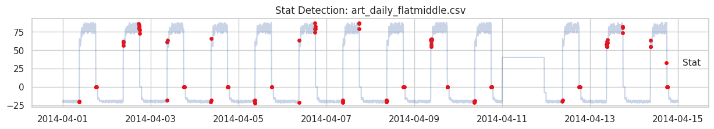

- Plot Stat

- Plot IF

- Model IF
[IF Model](./global_isolation_forest.pkl)

- Histogram + Density

- ACF

**Reflection**

Skewness = 0.4420 => Lệch phải nhẹ nhưng dưới mức 0.5, có thể dùng 3-sigma
Theo ACF, dữ liệu có tính chu kỳ theo ngày. Đỉnh biểu đồ đúng vào lag 288 (một ngày) => Period = 288 / Daily Pattern => Có thể dùng STL

Vì dữ liệu có tính chu kỳ cao, sử dụng STL là lựa chọn hợp lý hơn. Vì cho dù Skewness thấp nhưng theo biểu đồ Histogram thì dữ liệu vẫn không tuân theo Gaussian cho nên 3-sigma sẽ đưa ra kết quả không như ý muốn.

Theo như kết quả từ bảng so sánh, IF với Contamination = 0.2 sẽ đưa ra kết quả tốt hơn so với STL.

Để đưa ra quyết định đưa vào hệ thống thực tế (Production), chúng ta cần cân nhắc kỹ lưỡng cán cân đánh đổi giữa hai phương pháp:

| Tiêu chí | Isolation Forest ($Contamination = 0.2$) | STL Decomposition |
| --- | --- | --- |
| **Độ chính xác (Accuracy/F1-Score)** | **Cao hơn**. Bắt được cả ngoại lai toàn cục (Global) và ngoại lai ngữ cảnh mà không bị ảnh hưởng bởi phân phối lỗi. | **Trung bình**. Dễ bỏ sót các điểm dị biệt nếu biên độ chu kỳ thay đổi hoặc gán nhầm do phân phối không chuẩn. |
| **Độ phức tạp tính toán (Computational Cost)** | **Trung bình - Cao**. Cần tài nguyên để build các `iTrees`. Việc dự đoán trên luồng dữ liệu thực tế (Streaming) đòi hỏi chi phí tính toán lớn hơn. | **Thấp**. Thuật toán phân rã chuỗi thời gian tuyến tính, tính toán rất nhanh và tốn ít bộ nhớ. |
| **Khả năng giải thích (Explainability)** | **Thấp (Black-box)**. Khó giải thích rõ ràng lý do tại sao một điểm cụ thể lại bị coi là ngoại lai nếu chỉ nhìn vào điểm số cô lập (Anomaly Score). | **Cao (White-box)**. Rất trực quan. Có thể chỉ rõ điểm đó bất thường do xu hướng (Trend) tăng đột biến hay do phần dư (Residue) vượt ngưỡng. |
| **Độ nhạy tham số (Hyperparameters)** | Cực kỳ nhạy cảm với tham số `Contamination`. Nếu tỷ lệ nhiễu thực tế thay đổi, mô hình cần phải được tuning lại. | Nhạy cảm với việc chọn chiều dài cửa sổ (`Seasonal window`) và giả định phân phối của phần dư. |

---
**Lựa chọn triển khai thực tế (Production Choice)**

Dựa trên các phân tích trên, chiến lược triển khai trên môi trường Production được đề xuất theo hai hướng tiếp cận tùy thuộc vào kiến trúc hệ thống:

- Phương án 1: Chọn Isolation Forest làm Core Detector (Ưu tiên hiệu năng)

Nếu hệ thống ưu tiên tuyệt đối độ chính xác và có đủ tài nguyên tính toán, **Isolation Forest** sẽ là lựa chọn Production chính thức. Tuy nhiên, để khắc phục nhược điểm của nó trên dữ liệu chuỗi thời gian, ta cần áp dụng kỹ thuật **Feature Engineering**:

> **Giải pháp:** Không feed trực tiếp dữ liệu thô vào IF. Hãy tạo thêm các đặc trưng thời gian (Time-features) như: *Giờ trong ngày (0-23), Thứ trong tuần (2-CN), Giá trị trung bình trượt (Moving Average)*. Việc này giúp IF hiểu được tính chu kỳ $Period = 288$ của dữ liệu mà không cần thuật toán phân rã chuỗi thời gian.

- Phương án 2: Kiến trúc Hybrid (Tối ưu nhất)

Để tận dụng thế mạnh "giải thích được" của STL và "độ chính xác cao" của IF, kiến trúc lai (Hybrid) là tối ưu nhất cho Production:

1. Dùng **STL** để phân rã chuỗi dữ liệu thành 3 thành phần: $Trend$, $Seasonal$, và $Residue$.
2. Thay vì dùng 3-sigma trên phần $Residue$, ta **Sử dụng Isolation Forest** để huấn luyện trên phân phối của $Residue$ (hoặc kết hợp $Residue$ + $Trend$).

**Lý do chọn Hybrid:** Bước STL đã loại bỏ hoàn toàn tính chu kỳ ngày ($Period = 288$), làm phẳng dữ liệu, giúp IF tập trung hoàn toàn vào việc tìm ra các điểm bất thường thực sự ẩn sâu trong phần dư mà không bị nhiễu do yếu tố thời gian gây ra.

