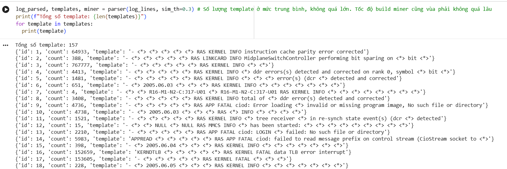
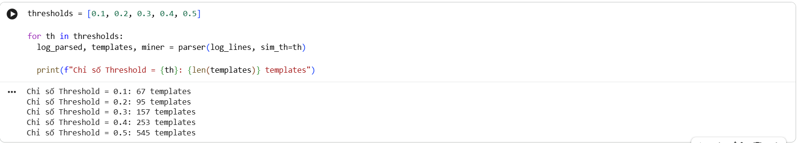

> [Tải Dataset từ đây](https://zenodo.org/records/8196385/files/BGL.zip?download=1)
*Nặng quá không push lên git được*

# Screenshot

- Plot Time Series + Anomaly Point

# Log
> [Notebook Full](./assignment.ipynb)

- Drain3 Template

> [Top 10 template](./top_templates.csv)

- Tuning

# Reflection
1. Drain3: Parse tốt khi log có cấu trúc tương đối đồng nhất và quan trọng phải tuning chỉ số Sim_Th
2. Template tốt cho insight là các template xuất hiện nhiều nhất (Ví dụ top 10 hay top 5 template) hoặc các template mới thay đổi cấu trúc
3. Log là dữ liệu thô dùng để phân tích lỗi chi tiết, còn metric là dữ liệu số học dùng để ML, Detect Anomaly