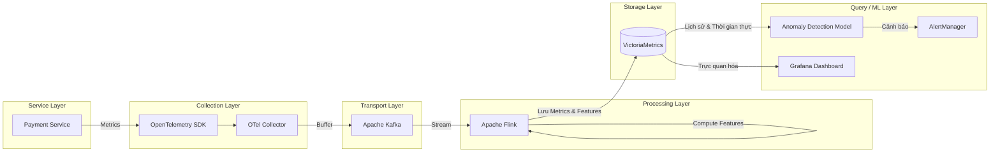

# Kiến trúc: Phát hiện bất thường cho Payment Service

Tài liệu này trình bày kiến trúc luồng dữ liệu End-to-End (E2E) nhằm phát hiện các điểm bất thường trong Payment Service (Dịch vụ Thanh toán).

## Use Case (Trường hợp sử dụng)
**Anomaly Detection trên Payment Service**: Phát hiện theo thời gian thực các bất thường trong metric giao dịch thanh toán (ví dụ: lượng giao dịch lỗi tăng đột biến, lượng giao dịch giảm đột ngột hoặc độ trễ bất thường) nhằm ngăn ngừa thất thoát doanh thu.

## Kiến trúc Data Layer E2E

## Lựa chọn công cụ cho các thành phần

1. **Service Layer**: Các microservice thanh toán được viết bằng Java/Go.
2. **Collection Layer**: **OpenTelemetry (OTel)**. OTel SDK được nhúng vào payment service để phát ra các metric (độ trễ, số lượng giao dịch, tỷ lệ lỗi). OTel Collector chạy dưới dạng DaemonSet để thu thập và chuyển tiếp dữ liệu.
3. **Transport Layer**: **Apache Kafka**. Đóng vai trò là bộ đệm có độ bền cao. Nó tách biệt các producer tạo metric khỏi processing layer, cho phép engine xử lý đọc stream một cách an toàn và ngăn ngừa mất dữ liệu trong các đợt tăng vọt lưu lượng (ví dụ: Black Friday).
4. **Processing Layer**: **Apache Flink**. Thực hiện stateful stream processing. Flink đọc các metric stream từ Kafka để tính toán các feature dạng cuộn (ví dụ: trung bình động 5 phút, tốc độ thay đổi) cần thiết cho các mô hình ML trong thời gian thực.
5. **Storage Layer**: **VictoriaMetrics**. Cơ sở dữ liệu Time-Series (TSDB) có khả năng mở rộng cao. Nó lưu trữ cả raw metric và các feature đã làm giàu được tính toán bởi Flink, với khả năng lưu giữ dài hạn tối ưu chi phí hơn so với Prometheus cục bộ.
6. **Query / ML Layer**: 
    - **ML Model**: Dịch vụ suy luận phát hiện bất thường bằng Python truy vấn VictoriaMetrics để lấy các feature theo thời gian thực.
    - **Visualization (Trực quan hóa)**: **Grafana** dùng để truy vấn VictoriaMetrics và vẽ các xu hướng thanh toán theo thời gian thực.
    - **Alerting (Cảnh báo)**: Prometheus Alertmanager được kết nối với đầu ra của Grafana/ML.
